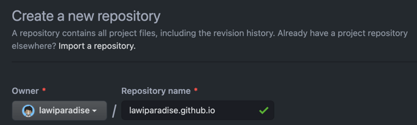
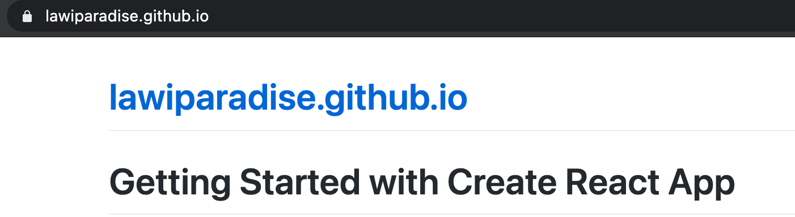
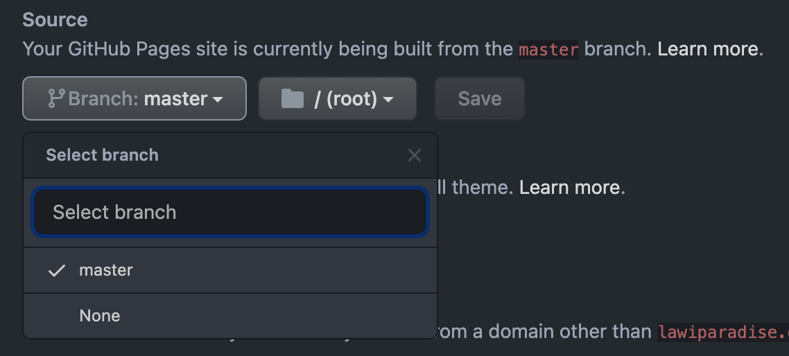
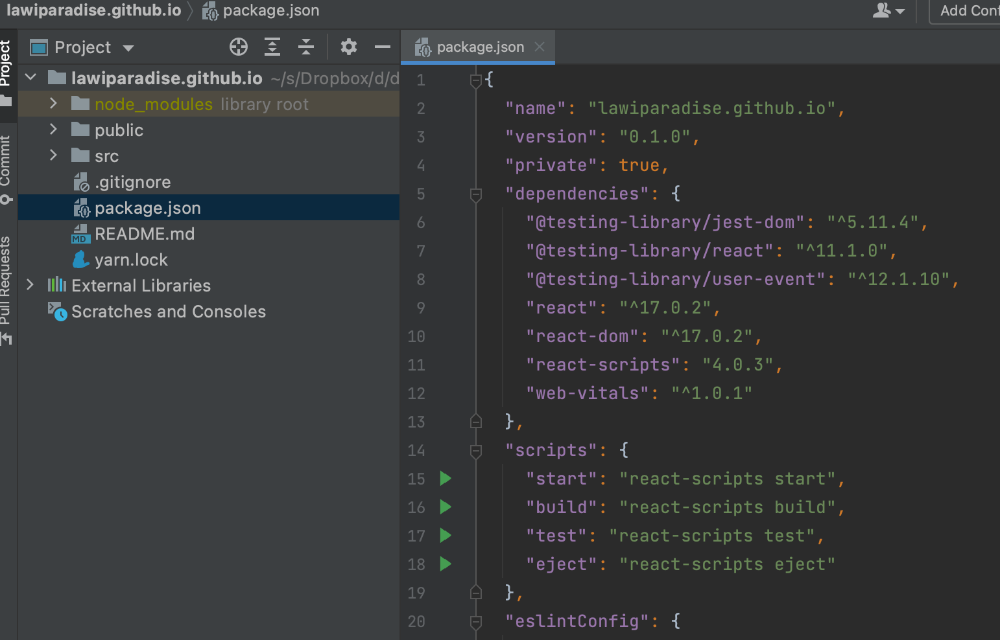
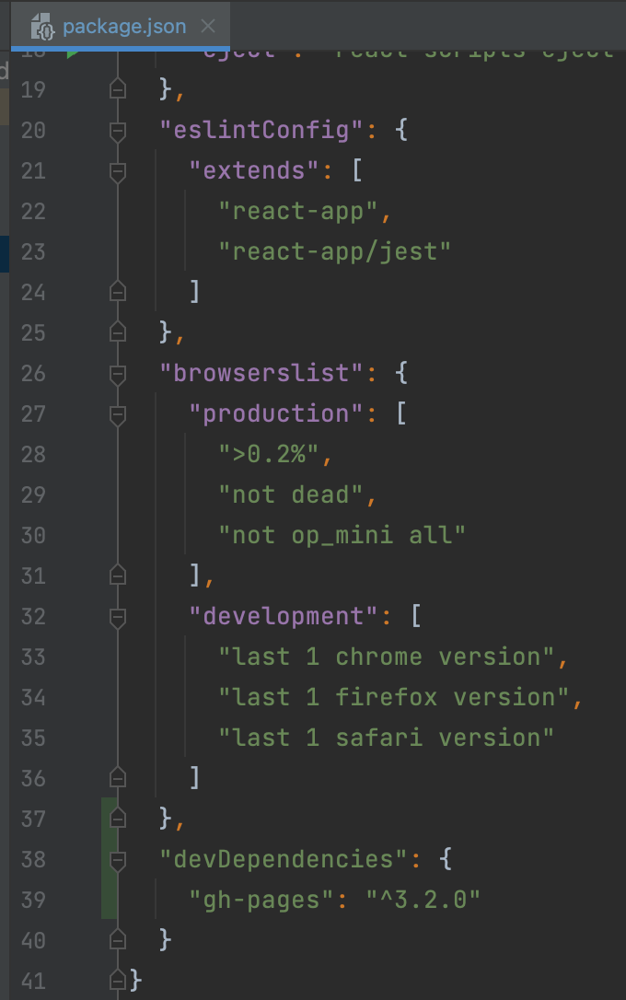
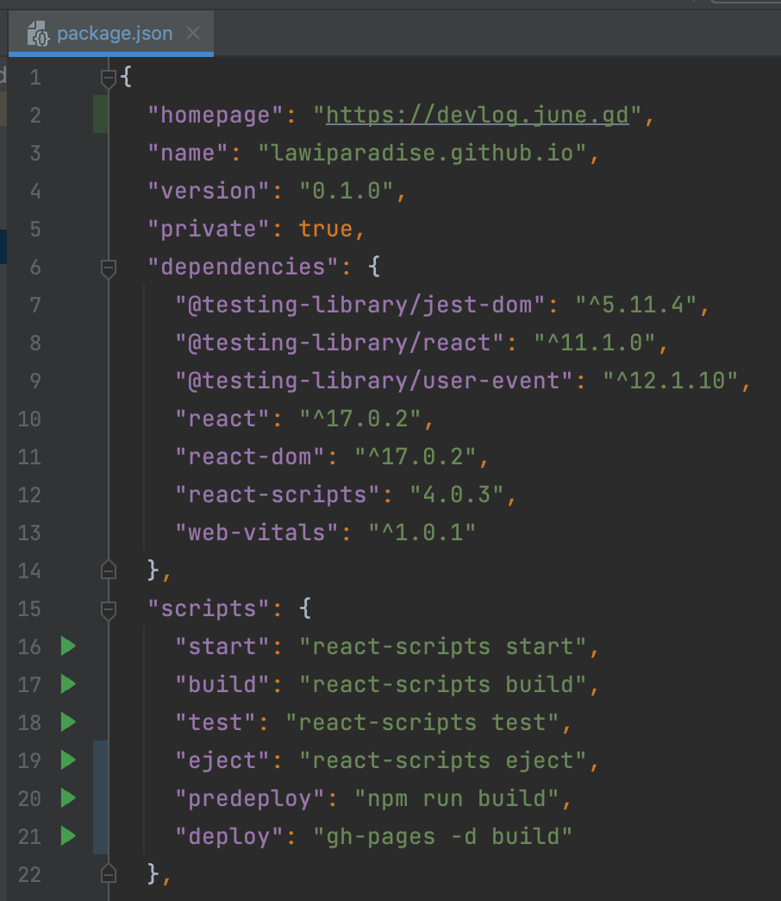
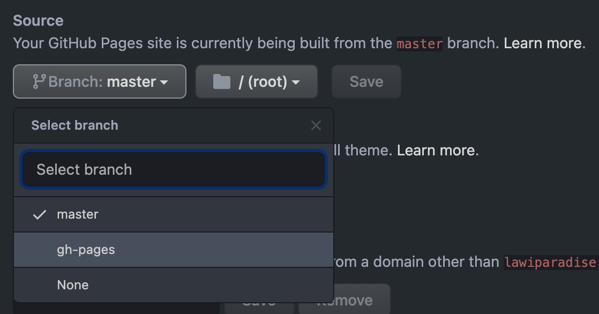
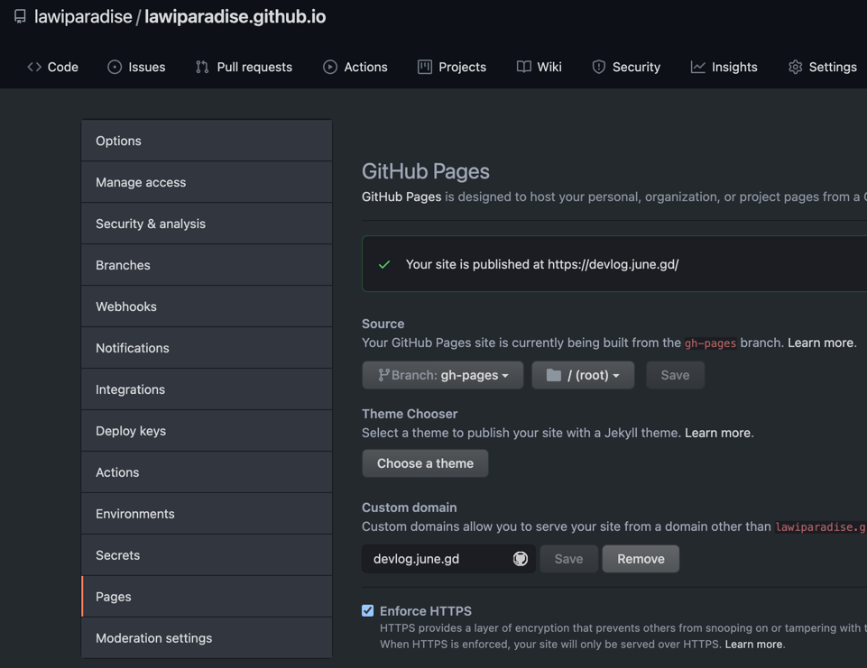
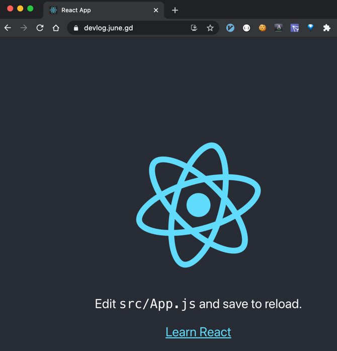

# 깃헙 페이지에 리액트 끼얹기

## 1. lawiparadise.github.io 레포 생성

## 2. 로컬 컴퓨터에서 작업
```shell
create-react-app lawiparadise.github.io # 리액트 프로젝트 만들기(git자동으로 만들어 줌)
cd lawiparadise.github.io
git remote add origin https://github.com/lawiparadise/lawiparadise.github.io.git # 원격 저장소 추가
git push origin master
```
- lawiparadise.github.io에 접속하면 다음 화면을 볼 수 있음

- 아직 깃헙 레포에 gh-pages브랜치는 없음

- package.json도 기본 값임

## 3. 이제 여기에 gh-pages관련 정보 추가 하면
```shell
npm install gh-pages --save-dev
```
- 이렇게 변경 됨

- 여기에 다음 정보 추가


## 4. 마지막으로 깃헙에 배포
```shell
npm run deploy # git commit 안해도 변경 됨
```
- 깃헙에서 다음 정보 확인 가능

- 다음과 같이 settings > pages 에서 정보 변경

- https://devlog.june.gd 에 접속하여 확인

  
- 로컬에서 확인은
```shell
yarn start # 내 꺼에 이미 yarn 설치되어 있음
```

## 5. npm run deploy 할 때마다 CNAME이 devlog.june.gd 에서 lawiparadise.github.io 로 풀리게 됨
```shell
vim CNAME
devlog.june.gd
```
```shell
vim package.json
"scripts": {
  ...
  "predeploy": "npm run build && cp CNAME build/CNAME",
  ...
},
```
